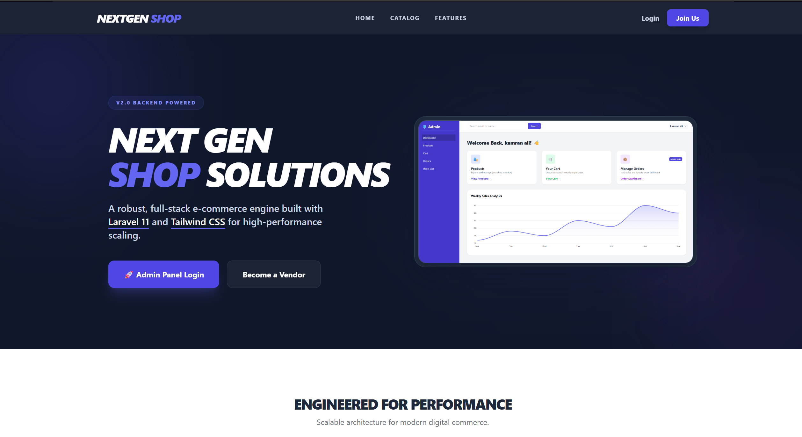
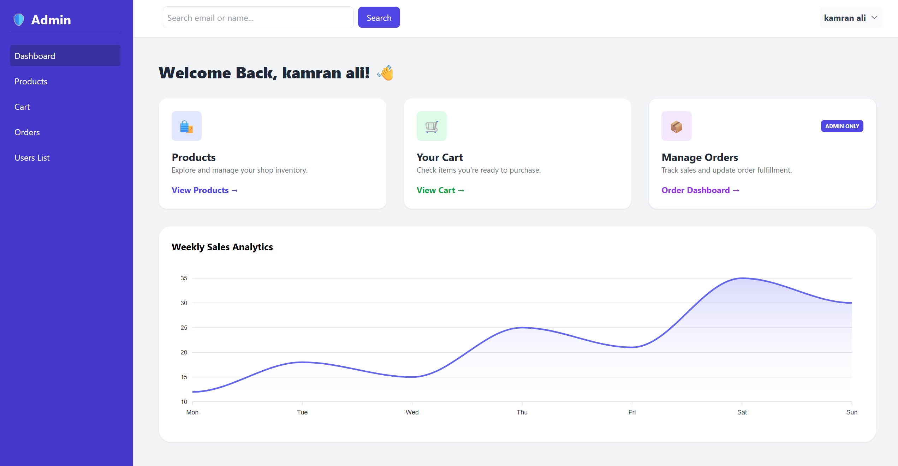
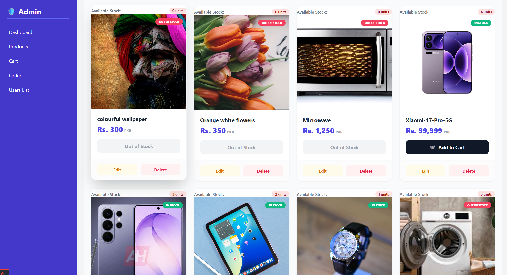
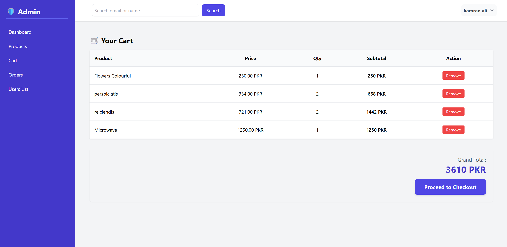
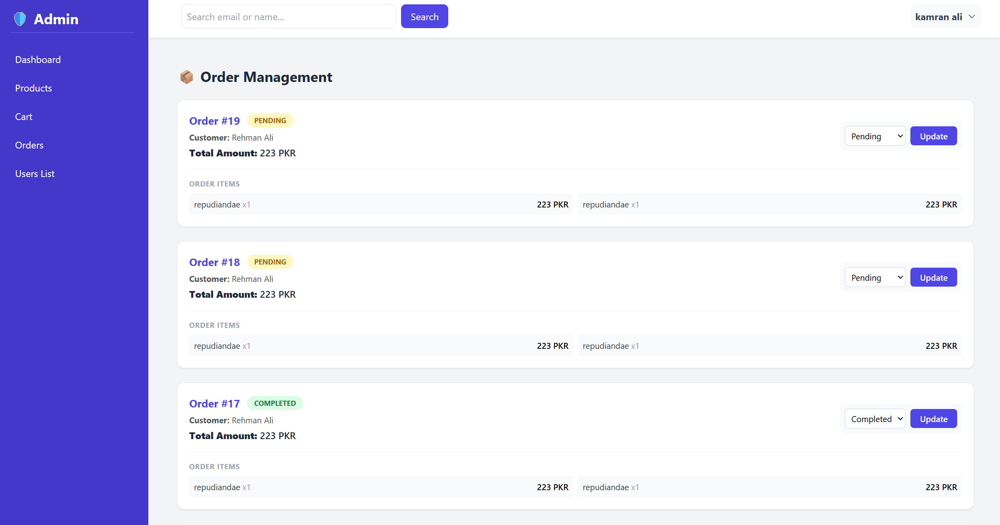
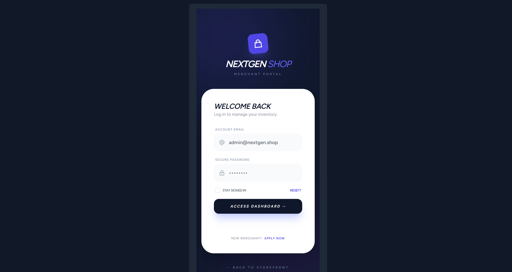
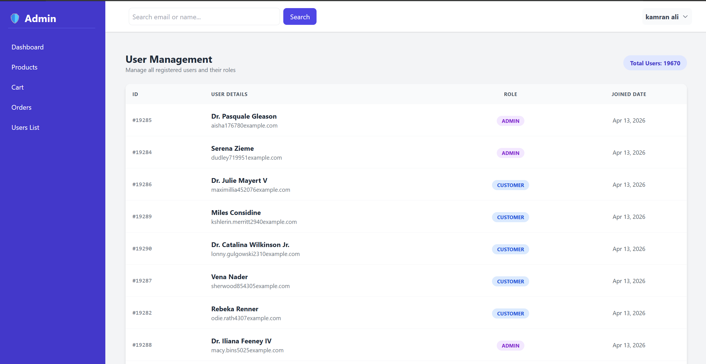

# 🛒 NEXT GEN SHOP (Web + API)

A modern **E-Commerce Application** built with Laravel featuring:

- 🧑‍💼 Admin Panel (Blade UI)
- 🛍️ Customer Shopping System
- ⚡ REST API (Sanctum Auth)
- 🧠 Clean Architecture (Service Layer)
- 🔐 Policy-based Security
- 📊 Performance Optimized Queries

---

## Project Preview

### Modern Admin Dashboard

### User Authentication

# 🚀 Features

## 👤 Authentication
- User registration & login (Blade + API)
- Laravel Sanctum token authentication
- Role-based system (Admin / Customer)

## 🛍️ Products
- Admin CRUD (Create, Update, Delete)
- API endpoints for products
- Pagination + optimized queries

## 🛒 Cart System
- Add to cart
- Remove from cart
- Quantity handling

## 📦 Orders
- Checkout system
- Order history
- Admin order management
- Status system (pending → completed)

## 🔐 Security
- Laravel Policies (Admin-only actions)
- Protected API routes (Sanctum)

## ⚡ Performance Optimization
- Eager Loading (avoid N+1 problem)
- Pagination
- Indexed columns (email)
- Optimized queries using select()

## 🧪 Testing Features
- 20000+ users seeded
- Search system with performance testing

---

# 🏗️ Architecture
